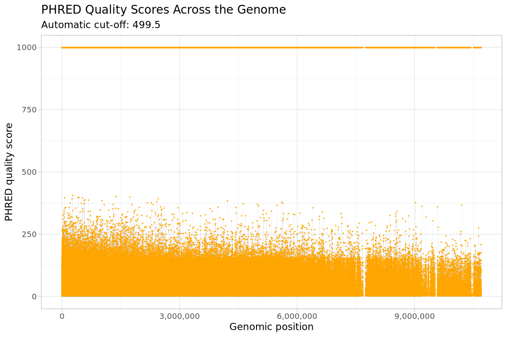

# PHRED Quality Distribution in *Luscinia*

This repository contains a complete and reproducible workflow to analyse the
distribution of PHRED quality scores from a VCF file, both genome-wide and by
individual chromosomes.

---

## Overview

The analysis includes:

- preprocessing of a VCF file using Unix tools  
- extraction of chromosome, genomic position and PHRED quality score  
- genome-wide visualisation of PHRED quality scores  
- per-chromosome visualisation using ggplot2  

---

## Input data

The original input file used in this analysis is:


/data-shared/vcf_examples/luscinia_vars.vcf.gz


This VCF file contains variant calls for *Luscinia*, including genomic
coordinates and PHRED quality scores.

---

## Repository structure

```text
luscinia-phred-analysis/
├── workflow.sh
├── data-analysis.R
├── data/
│   └── SelectedCols_luscinia_vars.tsv
├── plots/
│   ├── genomewide/
│   │   └── genomewide_PHRED.pdf
│   └── chromosomes/
│       ├── chr1_PHRED.pdf
│       └── ...
└── README.md
```

---

## Data processing pipeline (`workflow.sh`)

The file `workflow.sh` is an executable shell script that performs all data
preprocessing steps.

### Processing steps

1. Create the required output directories  
2. Copy and unzip the VCF file  
3. Remove metadata lines starting with `##`  
4. Extract the following columns:
   - CHROM (chromosome)
   - POS (genomic position)
   - QUAL (PHRED quality score)  
5. Save the processed data as a TSV file  
6. Automatically launch the R analysis script  

The resulting processed file is:

data/SelectedCols_luscinia_vars.tsv


### How to run the pipeline

From the repository root directory:

```bash
chmod +x workflow.sh
./workflow.sh
```
Data analysis and visualisation (data-analysis.R)

The R script data-analysis.R loads the processed data and generates all plots
using ggplot2.

The script:

- computes an automatic PHRED quality cut-off

- generates a genome-wide PHRED quality plot

- generates one PDF plot per chromosome

- saves all plots in organised subdirectories

The analysis can be run with:

Rscript data-analysis.R

Results
Genome-wide PHRED quality distribution




The following plot shows the distribution of PHRED quality scores across the
entire genome. Each point represents a variant plotted by genomic position and
PHRED quality score.

Description:
This plot provides an overview of variant quality across the genome. Higher
PHRED scores correspond to more reliable variant calls, while lower scores may
indicate less confident variants.

Per-chromosome PHRED quality distribution

Separate plots were generated for each chromosome and saved as individual PDF
files in:

plots/chromosomes/

Each file is named after the corresponding chromosome.

Description:
These plots allow chromosome-level inspection of PHRED quality score
distributions and facilitate comparison between chromosomes.


Software requirements

Unix/Linux shell environment

R (version ≥ 4.0)

R packages:

ggplot2

scales

Reproducibility

The entire analysis can be reproduced by running a single command from the
repository root directory and after it finishes, the R script can be launched

```
./workflow.sh
Rscript data-analysis.R
```

# disclaimer
i used chatgpt to control and refine the code and to help write the markdown; furthermore in the graphs i decided to project the x axis also on top because otherwhise the higher values would have visually covered the lower ones, i decided to keep everything and not to filter out because i wanted the script to be as universal as possible